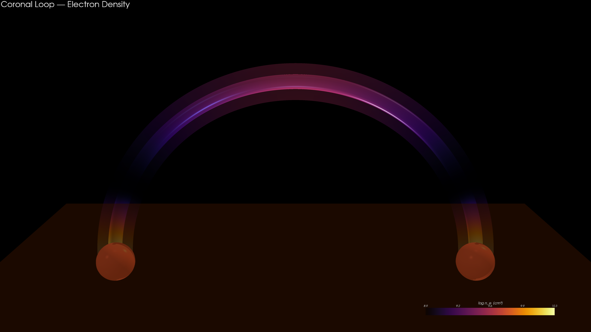
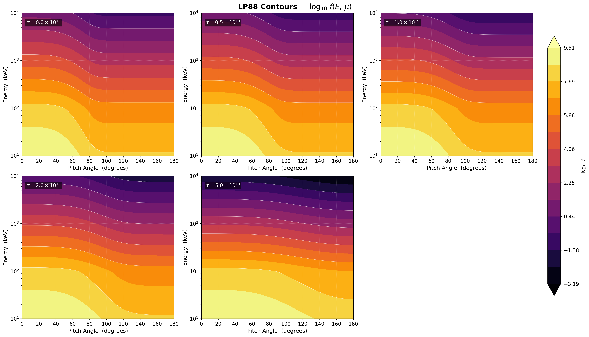
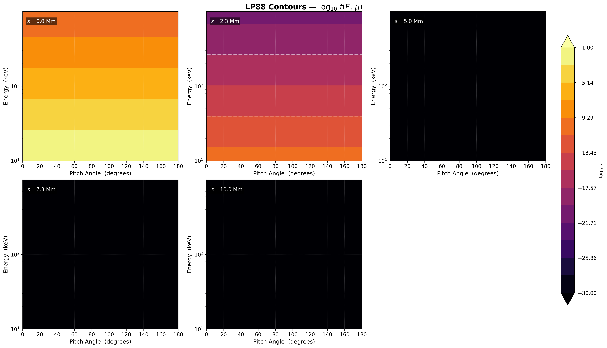
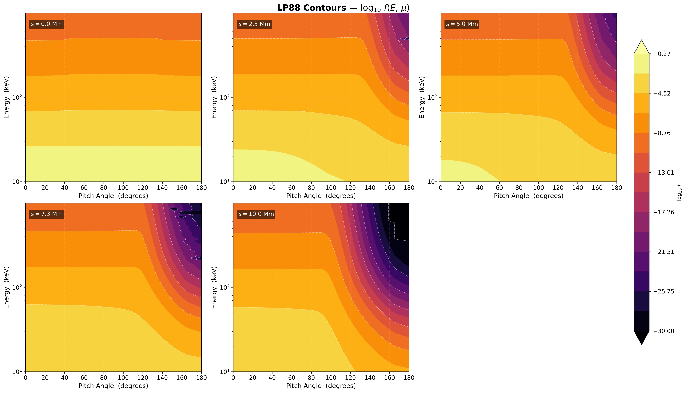
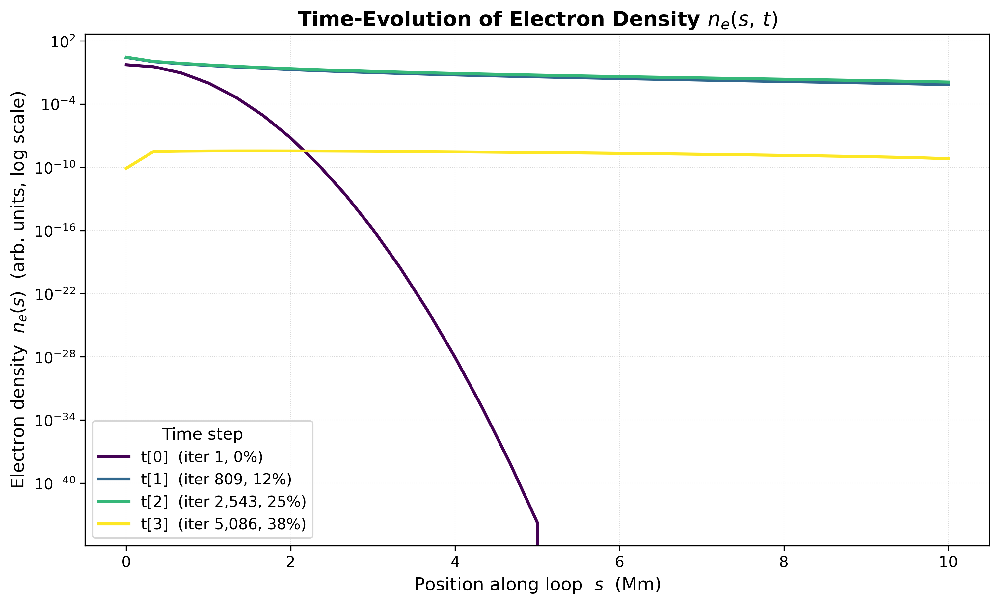

# Output Figures

Visualisations generated from the Time-Dependent Fokker-Planck electron
transport solver.  Each figure is produced by the corresponding Python script
in `scripts/python/`.

---

## 01 — 3D Coronal Loop Electron Density



**Script:** `scripts/python/plot_3d_coronal_loop.py`

A volumetric 3-D rendering of a semi-circular coronal loop
coloured by electron number density $n_e(s)$ on a $\log_{10}$ scale
(inferno colourmap).

**What we observe:**
- The loop is mapped from the 1-D spatial coordinate $s$ produced by
  the Fokker-Planck solver onto a semi-circular arc in 3-D ($x\text{-}z$ plane).
- **Footpoints** (orange spheres at $s = 0$ and $s = L$) show the highest
  density ($n_e \sim 2 \times 10^{10}$ cm$^{-3}$), representing the dense
  chromospheric plasma where the loop legs meet the solar surface.
- The **loop apex** (top of the arc) is fainter, reflecting the tenuous
  coronal plasma ($n_e \sim 5 \times 10^{8}$ cm$^{-3}$).
- An outer **glow shell** (semi-transparent, 2.5× tube radius) gives a
  visual impression of the extended coronal emission.
- The brown surface represents the solar chromosphere.
- Colour bar: $\log_{10} n_e$ [cm$^{-3}$], ranging from ~8.7 (corona) to
  ~10.3 (footpoints).

**Regenerate:**
```bash
uv run python scripts/python/plot_3d_coronal_loop.py \
    --save output/figures/01_coronal_loop_3d.png --resolution 2560x1440
```

---

## 02 — LP88 Contour Plots (Synthetic / Mock Data)



**Script:** `scripts/python/plot_2d_contours.py`

Filled contour plots of $\log_{10} f(E, \mu)$ in the **Energy (keV) vs.
Pitch-Angle (degrees)** plane, reproducing the style from
[Leach & Petrosian (1988)](https://ui.adsabs.harvard.edu/abs/1988ApJ...331..984L).

Each panel shows the electron distribution function at a different
column depth $\tau$ along the magnetic loop.

**What we observe:**
- **Panel $\tau = 0$:** The injected beam is strongly forward-peaked
  (concentrated at small pitch angles, $\theta \lesssim 40°$).
  The energy spectrum follows a power law $f \propto E^{-\delta}$.
- **Panels $\tau = 0.5$–$1.0 \times 10^{19}$:** Coulomb scattering begins to
  isotropise the beam — contours spread toward larger pitch angles.
  High-energy electrons ($E > 1$ MeV) retain their anisotropy longer
  because they have longer mean free paths.
- **Panel $\tau = 2.0 \times 10^{19}$:** The distribution approaches
  isotropy for lower energies ($E < 100$ keV) while the highest energies
  still show residual forward beaming.
- **Panel $\tau = 5.0 \times 10^{19}$:** Nearly complete isotropisation.
  The contours are almost horizontal (energy-only dependence) —
  scattering has erased the initial directional information.

This progressive isotropisation with increasing column depth is the
central result of LP88 and validates the Fokker-Planck solver's
pitch-angle diffusion operator.

**Regenerate:**
```bash
uv run python scripts/python/plot_2d_contours.py \
    --save output/figures/02_lp88_contours_mock.png
```

---

## 03 — LP88 Contour Plots (Simulation Data)



**Script:** `scripts/python/plot_2d_contours.py`

Same contour format as Figure 02, but using **real Fortran simulation
output** from `experiments/conf_original/fkrplk.test` at time index 0
(initial injection).

**What we observe:**
- **Panel $s = 0.0$ Mm (injection point):** A bright, isotropic
  power-law distribution — the initial condition.  All pitch angles
  receive equal flux, as expected from the isotropic injection model
  ($f \propto (E_0/E)^5$, uniform in $\mu$).
- **Panel $s = 2.3$ Mm:** The distribution has already dropped by
  several orders of magnitude.  Only low-energy electrons
  ($E < 100$ keV) retain significant flux — high-energy particles
  have undergone substantial energy loss via Coulomb collisions.
- **Panels $s = 5.0$–$10.0$ Mm:** The distribution function is
  effectively zero ($\log_{10} f < -30$), indicating that no electrons
  have yet propagated to these positions at $t = 0$.  This confirms the
  correct initial localisation of the injection at $s = 0$.

As the simulation evolves in time, electrons will populate these
deeper spatial positions, and the contours will develop the LP88-style
beam isotropisation pattern seen in the mock data.

**Regenerate:**
```bash
uv run python scripts/python/plot_2d_contours.py \
    --data experiments/conf_original/fkrplk.test --time-index 0 \
    --save output/figures/03_lp88_contours_real.png
```

---

## 04 — LP88 Contour Plots (Simulation Data — After Propagation, t=2)



**Script:** `scripts/python/plot_2d_contours.py`

Same format as Figure 03, but at **time index 2** (iteration ~2543) —
the electron beam has now propagated along the loop and the distribution
has reached a quasi-steady state with full spatial structure.

**What we observe:**
- **Panel $s = 0.0$ Mm (injection point):** The distribution retains
  its isotropic, power-law character across all energies ($\log_{10} f$
  ranges from $\sim -0.3$ at low E to $\sim -9$ at MeV energies).
  This is the continuously injected source.
- **Panel $s = 2.3$ Mm:** The first signs of pitch-angle anisotropy
  appear — backward-traveling electrons ($\theta > 120°$) are depleted
  at high energies ($E > 300$ keV), while forward-directed electrons
  maintain higher flux.  Coulomb collisions have begun energy-degrading
  the lower-energy population.
- **Panel $s = 5.0$ Mm (loop midpoint):** Dramatic anisotropy at
  $E > 100$ keV — the distribution drops by 10+ orders of magnitude
  between $\theta = 0°$ (forward) and $\theta = 180°$ (backward).
  Only the most energetic forward-beamed electrons penetrate to this
  depth, consistent with the LP88 prediction.
- **Panels $s = 7.3$–$10.0$ Mm:** The low-energy population
  ($E < 30$ keV) appears isotropic and occupies the brightest contour
  levels, indicating thermalised electrons.  High energies show a
  strong forward-backward asymmetry, with backward-hemisphere flux
  ($\theta > 90°$) approaching the floor ($\log_{10} f < -25$).

This time step demonstrates the **full Fokker-Planck transport
physics**: energy loss, pitch-angle scattering, and spatial propagation
acting simultaneously on the electron beam.

**Regenerate:**
```bash
uv run python scripts/python/plot_2d_contours.py \
    --data experiments/conf_original/fkrplk.test --time-index 2 \
    --save output/figures/04_lp88_contours_real_t2.png
```

---

## 05 — LP88 Contour Plots (Simulation Data — Early Propagation, t=1)


**Script:** `scripts/python/plot_2d_contours.py`

Same format at **time index 1** (iteration ~809) — an earlier snapshot
during beam propagation.

**What we observe:**
- The overall structure is very similar to Figure 04 (t=2), confirming
  that the simulation has already reached quasi-steady state by this
  time step.
- The injected beam at $s = 0$ and the progressive depletion at
  larger depths are consistent across both snapshots, demonstrating
  temporal convergence of the Fokker-Planck solution.

**Regenerate:**
```bash
uv run python scripts/python/plot_2d_contours.py \
    --data experiments/conf_original/fkrplk.test --time-index 1 \
    --save output/figures/05_lp88_contours_real_t1.png
```

---

## 06 — Time-Evolution of Electron Density



**Script:** `scripts/python/plot_density_evolution.py`

Macroscopic electron density $n_e(s, t)$ obtained by integrating the
distribution function over energy and pitch-angle:

$$n_e(s, t) = \int_{E_{\min}}^{E_{\max}} \int_{-1}^{1} f(E, \mu, s, t)\, d\mu\, dE$$

Each line corresponds to a different simulation time step, coloured with
the **viridis** colourmap from early (dark purple) to late (yellow).

**What we observe:**
- **t[0] — initial injection (dark purple):** The electron density is
  strongly concentrated near the injection point ($s = 0$).  The beam
  profile shows a steep exponential decay — only the lowest-energy
  electrons have their phase-space filled, and the density plummets
  by ~40 orders of magnitude between $s = 0$ and $s = 5$ Mm.
- **t[1]–t[2] — beam propagation (blue/green):** The beam has
  spread across the full coronal loop.  Density at the injection point
  is the highest ($n_e \sim 10$), but now electrons populate all spatial
  positions with $n_e \sim 10^{-2}$–$10^{-4}$ at the far footpoint.
  The gentle slope reflects Coulomb-loss equilibrium, where injection
  balances energy loss.
- **t[3] — late decay (yellow):** The distribution has decayed to
  $\sim 10^{-10}$ everywhere.  The nearly flat profile shows that
  residual electrons are uniformly thermalised along the loop — the
  beam has been fully absorbed.

This figure captures the **macroscopic consequence** of the Fokker-Planck
transport: the transition from a localised injection to a loop-filling
electron population, and finally to dissipation.

**Regenerate:**
```bash
uv run python scripts/python/plot_density_evolution.py \
    --data experiments/conf_original/fkrplk.test \
    --save output/figures/06_density_evolution.png
```

---

## How to regenerate all figures

```bash
# From the project root:
uv run python scripts/python/plot_3d_coronal_loop.py \
    --save output/figures/01_coronal_loop_3d.png --resolution 2560x1440

uv run python scripts/python/plot_2d_contours.py \
    --save output/figures/02_lp88_contours_mock.png

uv run python scripts/python/plot_2d_contours.py \
    --data experiments/conf_original/fkrplk.test --time-index 0 \
    --save output/figures/03_lp88_contours_real.png

uv run python scripts/python/plot_2d_contours.py \
    --data experiments/conf_original/fkrplk.test --time-index 2 \
    --save output/figures/04_lp88_contours_real_t2.png

uv run python scripts/python/plot_2d_contours.py \
    --data experiments/conf_original/fkrplk.test --time-index 1 \
    --save output/figures/05_lp88_contours_real_t1.png

uv run python scripts/python/plot_density_evolution.py \
    --data experiments/conf_original/fkrplk.test \
    --save output/figures/06_density_evolution.png
```
